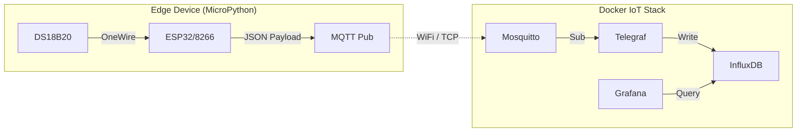

# Architecture Patterns

**Domain:** IoT Temperature Monitor (MicroPython)
**Researched:** Tue Feb 17 2026

## Recommended Architecture

The system follows a classic **Publisher-Subscriber (Pub/Sub)** architecture for the edge devices, coupled with a **Time-Series Ingestion Pipeline** for the backend.

### High-Level Diagram



### Component Boundaries

| Component | Responsibility | Communicates With | Data Format |
|-----------|---------------|-------------------|-------------|
| **Edge Device** | Reads sensor, manages WiFi/MQTT connection, formats data, handles deep sleep (optional). | **Mosquitto** (Publisher) | JSON (e.g., `{"temp": 24.5, "rssi": -60}`) |
| **Mosquitto** | MQTT Broker. Receives publications and routes to subscribers. Handles authentication. | **Edge Device** (Ingress), **Telegraf** (Egress) | MQTT Protocol |
| **Telegraf** | Data Processor. Subscribes to MQTT topics, parses JSON, adds tags, buffers data, and writes to DB. | **Mosquitto** (Subscriber), **InfluxDB** (Writer) | JSON (Input) → Line Protocol (Output) |
| **InfluxDB** | Time-series database. Stores timestamped sensor data efficiently. | **Telegraf** (Write API), **Grafana** (Query API) | InfluxDB Line Protocol (Write), Flux (Read) |
| **Grafana** | Visualization. Queries DB to build dashboards and alerts. | **InfluxDB** (Data Source) | Flux Query Language |

### Data Flow

1.  **Acquisition:** `main.py` triggers a sensor read via `ds18x20` driver (750ms conversion).
2.  **Formatting:** value is wrapped in a JSON object with metadata (e.g., `{"value": 22.5, "unit": "C", "device_id": "esp32_01"}`).
3.  **Transmission:** `mqtt_as` publishes payload to topic `tele/home/kitchen/temp`.
4.  **Routing:** Mosquitto receives message and forwards to Telegraf (subscriber).
5.  **Transformation:** Telegraf `inputs.mqtt_consumer` parses JSON, converts to InfluxDB Line Protocol.
6.  **Storage:** Telegraf `outputs.influxdb_v2` writes to InfluxDB bucket `sensors`.
7.  **Visualization:** Grafana queries InfluxDB via Flux to render charts.

## Patterns to Follow

### Pattern 1: Asyncio-First (Recommended)
**What:** Use `uasyncio` and `mqtt_as` for the main loop.
**When:** Always, unless on extreme battery constraints.
**Why:** Standard `umqtt` is blocking. If WiFi drops during a publish, the device hangs. `mqtt_as` handles background reconnection transparently while your sensor loop keeps running (or waits cleanly).
**Example:**
```python
async def main():
    await client.connect()
    while True:
        temp = read_sensor() # Non-blocking wrapper
        await client.publish(TOPIC, json.dumps({"temp": temp}), qos=1)
        await asyncio.sleep(60)
```

### Pattern 2: Config-as-Code (Separation)
**What:** Store credentials (SSID, MQTT pass) in a `config.json` file, not `main.py`.
**When:** Always.
**Why:** Allows you to commit code to Git without leaking secrets. Allows changing WiFi without reflashing firmware (just upload new config).

### Pattern 3: The "Telegraf Glue"
**What:** Use Telegraf to bridge MQTT to InfluxDB, rather than writing a custom Python script or Node-RED flow.
**When:** Standard IoT stacks.
**Why:** Telegraf handles batching, buffering (if Influx is down), and data type conversion (JSON -> Line Protocol) out of the box with zero code.

## Anti-Patterns to Avoid

### Anti-Pattern 1: The "Mega-Loop"
**What:** A single `while True:` loop with `time.sleep(60)`.
**Why bad:** During `sleep(60)`, the device cannot process network packets (PINGs, ACKs). This leads to MQTT disconnects ("KeepAlive timeout") and instability.
**Instead:** Use `uasyncio` tasks or `mqtt_as`.

### Anti-Pattern 2: Hardcoded Topic Names
**What:** Embedding `kitchen/temp` deep in the code.
**Why bad:** Prevents deploying the same code to multiple devices.
**Instead:** Construct topics dynamically from a `device_id` in `config.json` or the MAC address. E.g., `tele/{config['device_id']}/temp`.

### Anti-Pattern 3: Sending Raw Floats
**What:** Publishing just `24.5` to the topic.
**Why bad:** Not extensible. If you want to add humidity or RSSI later, you break the parser.
**Instead:** Always publish JSON objects. `{"temp": 24.5}`.

## Scalability Considerations

| Concern | At 1 Device | At 100 Devices | At 1000 Devices |
|---------|-------------|----------------|-----------------|
| **Broker Load** | Negligible. | Low. Mosquitto handles 10k+ easily. | Moderate. Ensure file descriptor limits are raised. |
| **Topic Structure** | Flat is fine. | Hierarchical is required (`site/floor/room/device`). | Strict taxonomy required. Wildcard subs cost more CPU. |
| **Ingestion** | Direct write OK. | Telegraf buffering essential. | Kafka buffer might be needed before InfluxDB. |

## Suggested Build Order

1.  **Infrastructure:** Deploy `docker-compose.yml` with Mosquitto, InfluxDB, Telegraf, Grafana. Verify containers are healthy.
2.  **Connectivity Stub:** Flash MicroPython + `mqtt_as`. Write a script that just connects to WiFi/MQTT and publishes "Hello" every 10s. Verify in Mosquitto.
3.  **Sensor Integration:** integrate `ds18x20` code. Verify readings in REPL.
4.  **End-to-End Data:** Update script to publish sensor JSON. Configure Telegraf to parse it. Verify data appears in InfluxDB Data Explorer.
5.  **Visualization:** Build Grafana dashboard using InfluxDB data.

## Sources

- [Peter Hinch's mqtt_as Architecture](https://github.com/peterhinch/micropython-mqtt)
- [InfluxData IoT Reference Architecture](https://www.influxdata.com/solutions/iot/)
- [MicroPython uasyncio Documentation](https://docs.micropython.org/en/latest/library/uasyncio.html)
