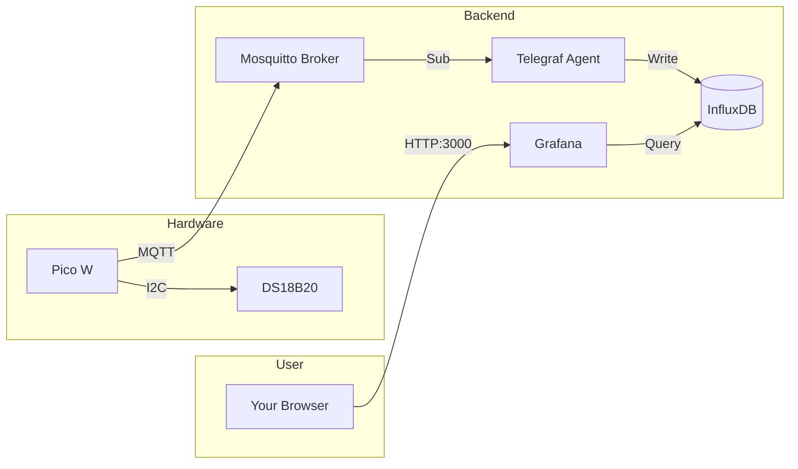

# Zour-Dough in MicroPython

This is a project about sour dough.

The purpose of this project is to build a system that keeps sour dough at a temperature of 28 degree celsius to build the perfect environment for the grow of the lactic acid bacteria. 

## Step 1: Install MicroPython on Your RP2350

If you haven't already:

1. Download the MicroPython UF2 file for RP2350 from [micropython.org](https://micropython.org). It is stored here under firmware folder
2. Hold the BOOTSEL button on your RP2350 while plugging it into your computer
3. It will appear as a USB drive - drag the UF2 file onto it
4. It will reboot with MicroPython installed

## Step 3: Configure Project

### Backend Secrets
1. Copy the example environment file:
   ```bash
   cp backend/.env.example backend/stack.env
   ```
2. Update `backend/stack.env` with your secure credentials.

### Firmware Secrets
1. Copy the example configuration file:
   ```bash
   cp mqtt_local.py.example mqtt_local.py
   ```
2. Open `mqtt_local.py` and enter your WiFi and MQTT broker details:
   - `ssid`: Your WiFi Network Name
   - `wifi_pw`: Your WiFi Password
   - `server`: IP Address of your computer running the MQTT broker (e.g. `192.168.1.50`)

**Note:** Both `mqtt_local.py` and `backend/stack.env` are ignored by git to keep your passwords safe.

## Step 4: Install Thonny IDE

Download and install [Thonny](https://thonny.org) - it's the easiest IDE for MicroPython beginners. It lets you write code and see the console output.

## Step 5: Start the Backend (Infrastructure as Code)

This project uses Infrastructure as Code (IaC) to define the backend stack in `backend/docker-compose.yml`. This means you can spin up the entire system (MQTT Broker, Database, Dashboard) with a single command, and it will be configured exactly as defined in the code.

1. Navigate to the backend directory:
   ```bash
   cd backend
   ```
2. Start the services:
   ```bash
   docker compose --env-file stack.env up -d
   ```

**What runs:**
- **Mosquitto:** MQTT Broker (Receives sensor data)
- **Telegraf:** Data Collector (Bridges MQTT -> InfluxDB)
- **InfluxDB:** Time-Series Database (Stores temperature history)
- **Grafana:** Visualization Dashboard (Displays charts at http://localhost:3000)

**IaC Features:**
- **Automated Provisioning:** Grafana automatically connects to InfluxDB on startup using config files in `backend/grafana/provisioning/`.
- **Dashboard-as-Code:** The "Temperature Monitor" dashboard is defined in `backend/grafana/dashboards/main.json`, so it persists across container restarts.


# Architecture

The system follows a classic **IoT Data Pipeline** pattern:



**Data Flow:**
1.  **Sensor:** Reads temperature every 10s.
2.  **Pico W:** Publishes JSON to MQTT topic `sensors/ds18b20/<id>`.
3.  **Mosquitto:** Receives message and holds it.
4.  **Telegraf:** Subscribes to MQTT, converts JSON -> Influx Line Protocol.
5.  **InfluxDB:** Stores time-series data.
6.  **Grafana:** Queries InfluxDB to visualize history.

# Maintenance

### Checking Disk Usage
The data (InfluxDB) and dashboards (Grafana) are stored in Docker volumes. To see how much space they are using:
```bash
docker system df -v | grep "backend_"
```
*Expected growth: ~100-200 MB per year for one sensor.*

### Data Retention
By default, the system keeps data **forever**. If you want to change this (e.g., to 1 year) for a *new* installation, add this to `backend/stack.env`:
```bash
DOCKER_INFLUXDB_INIT_RETENTION=52w
```
*(Note: This only affects new setups. For existing data, you must update the bucket retention policy via the InfluxDB CLI or UI.)*
